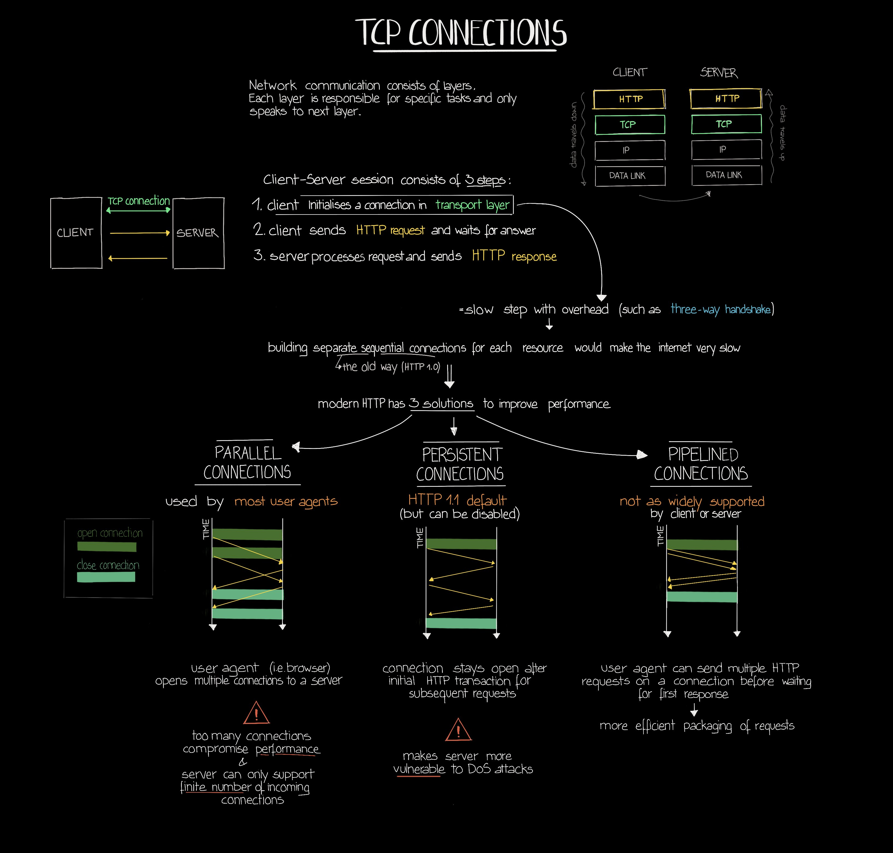
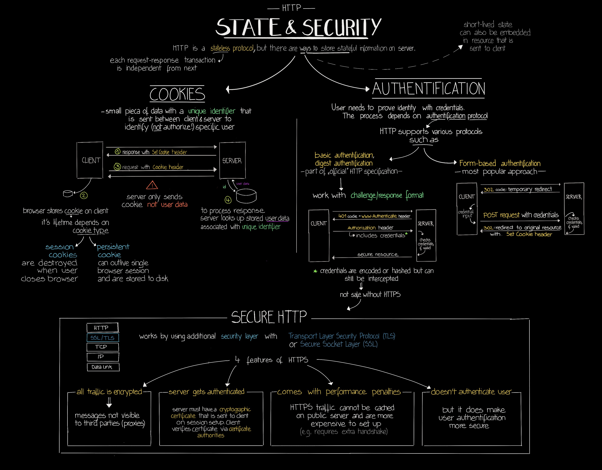

# Internet Fundamentals

## What is the Internet ?
The internet is the wider network that allows computer networks around the world run by companies, governments, universities and other organisations to talk to one another

## What is DNS
Stands for **Domain Name System**. In layman terms it is the Phone Book of internet. It translates the human readable website name (Domain Name) to machine readable IP (Internet Protocol) Address

## DNS Resolver
It is also called a recursive resolver, is a server designed to receive DNS queries from web browsers and other applications. The resolver receives a hostname - for example, [www.example.com](http://www.example.com/) - and is responsible for tracking down the IP address for that hostname. When it receives the IP, the query is resolved.

## DNS Lookup
It is the complete process of finding the IP address for the given domain name

Sequence of cache checks for finding the IP address for the domain name
1. Browser Cache
2. Operating System Cache
3. Router Cache
4. ISP DNS Cache

## HTTP
Stands for Hyper Text Transfer Protocol

### HTTP Status Codes (Categorized)

`100 - 199` Informational responses

`200 - 299` Successful responses

`300 - 399` Redirects

`400 - 499` Client Errors

`500 -599` Server Errors

### Port Number

The default port of http is `80`

The default port of https is `443`

### HTTP Request Methods

1. GET

1. HEAD

1. POST

1. PUT

1. PATCH

1. DELETE

### HTTP Request Headers

To be updated
  
## Infographics

## References

[HTTP response status codes | MDN](https://developer.mozilla.org/en-US/docs/Web/HTTP/Status)

[A List of all HTTP Status Codes](https://www.notion.so/c63957d70d7242a29b883ff3532fea50)