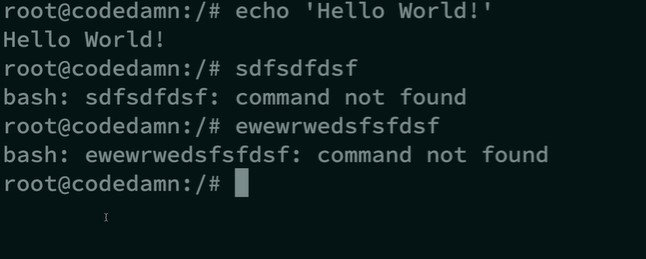

# Linux Fundamentals

## `clear`
clears out the entire terminal 

## `echo`
returns the string which has been passed

## What is terminal ?

## What is shell ?

## What is bash ?

## What is difference between terminal and shell ?